# Paper

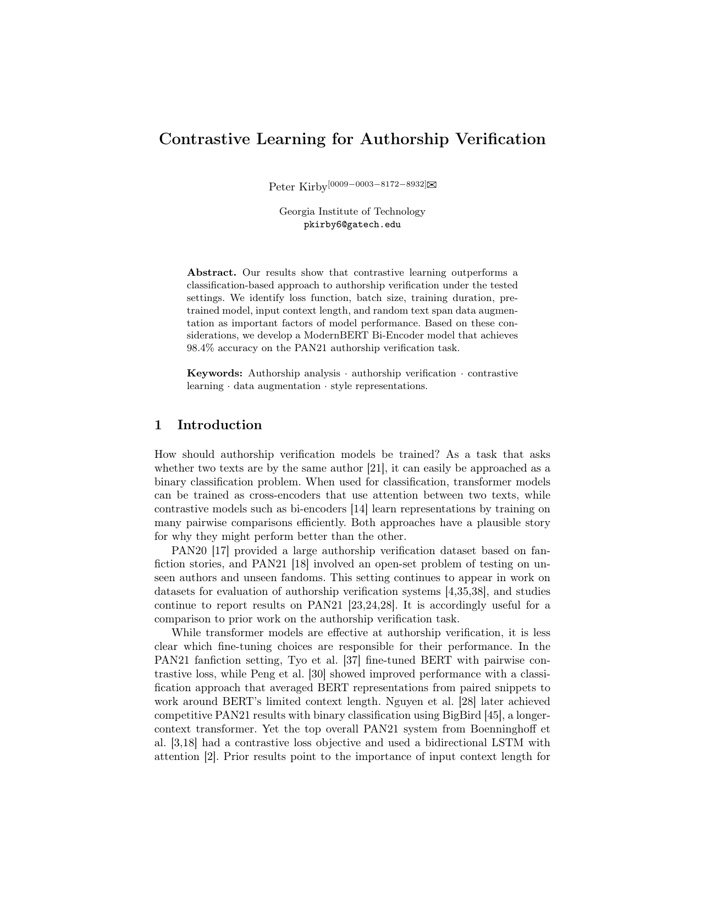 
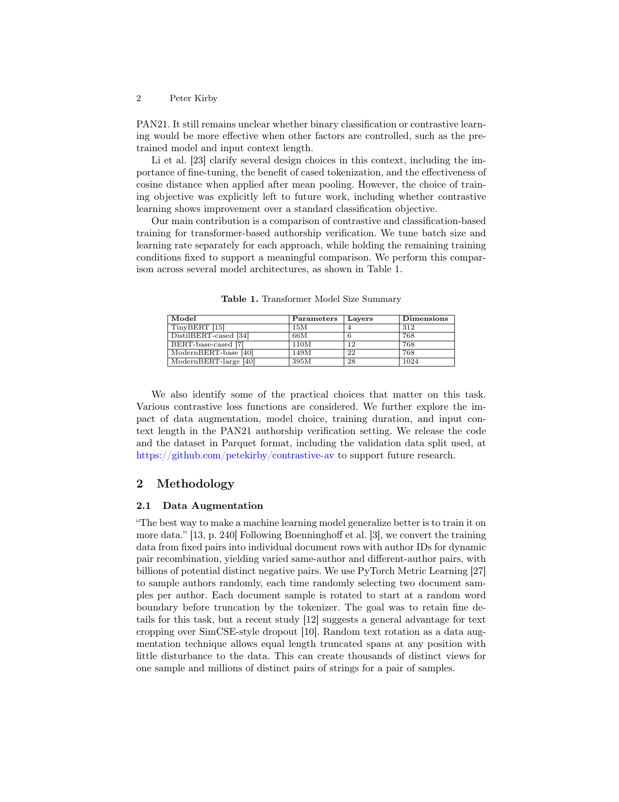 
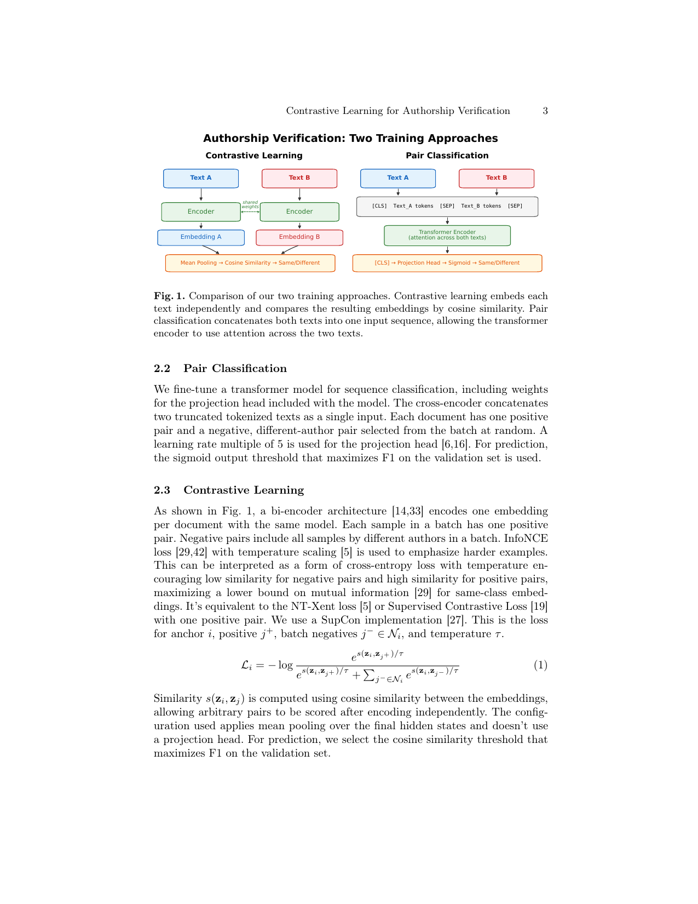 
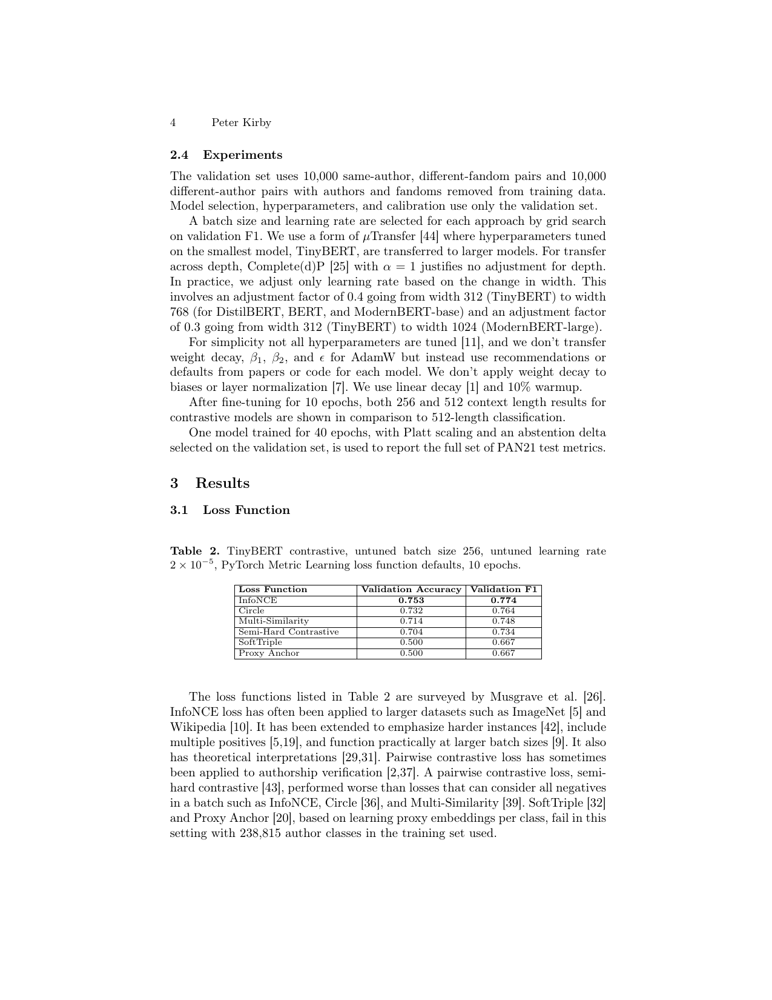 
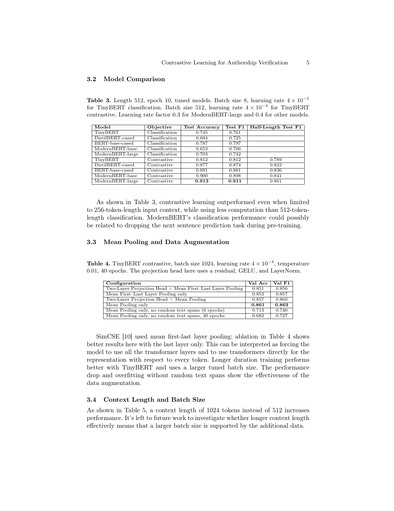 
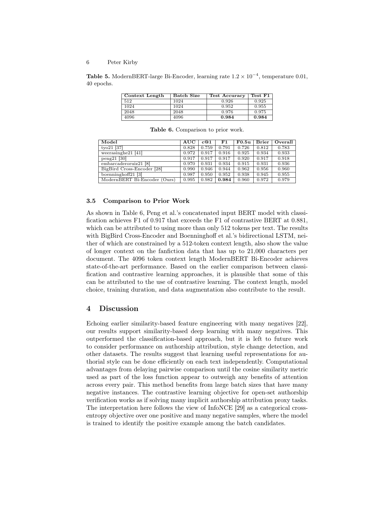 
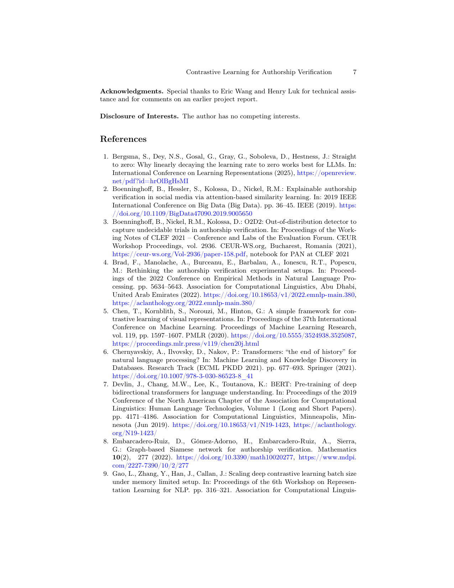 
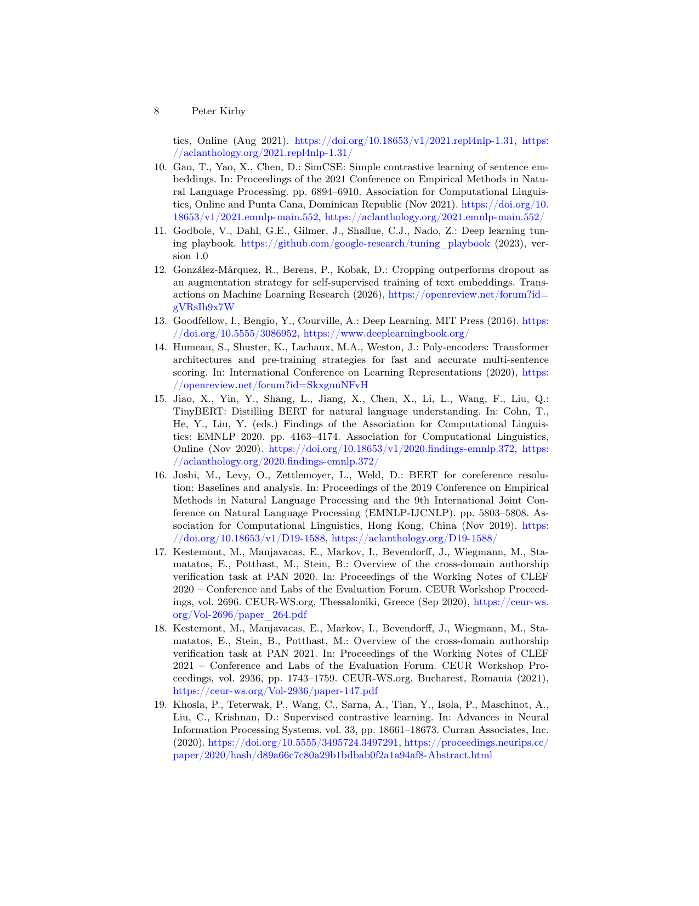 
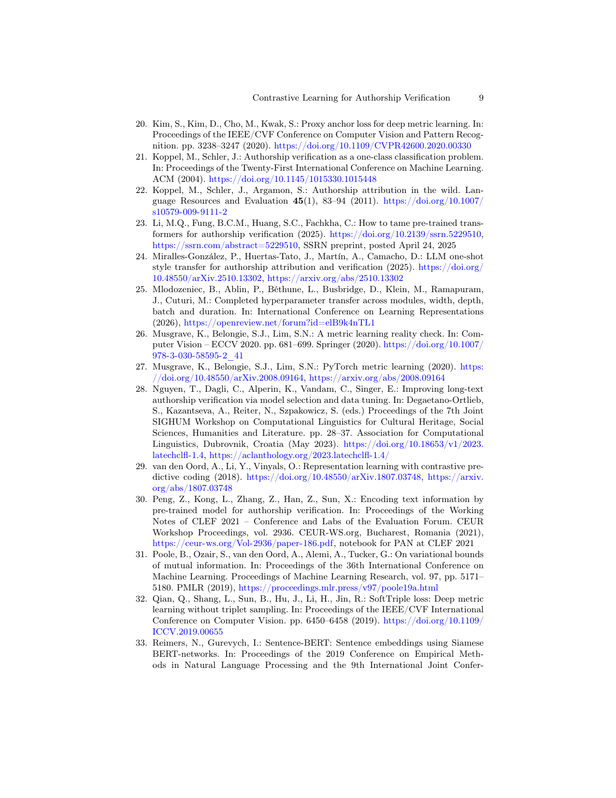 
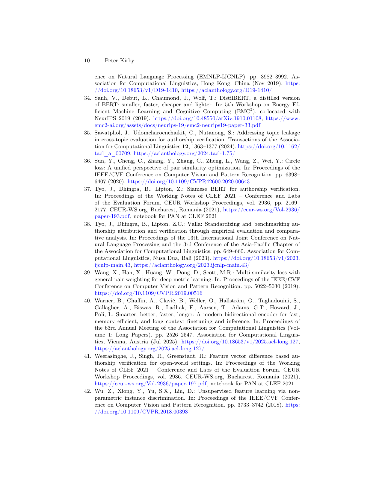 
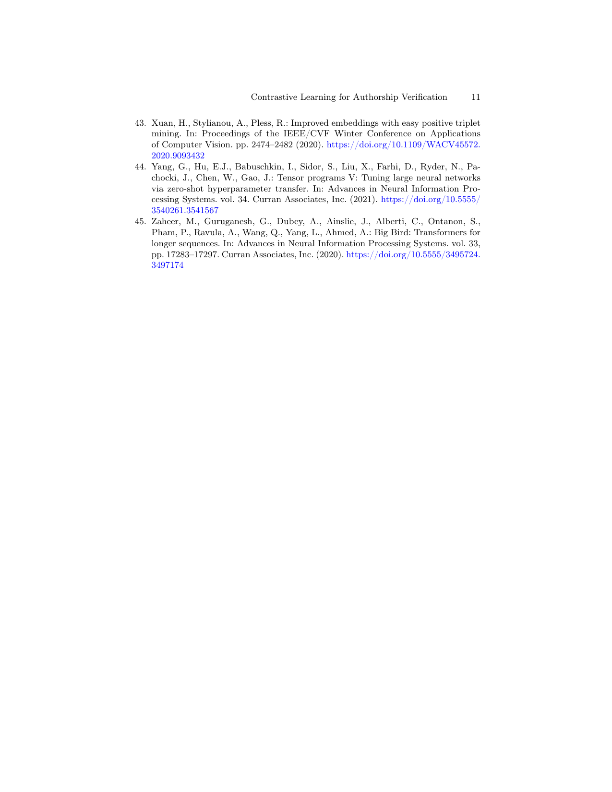

# Data

[peterkirby/pan2020_dict_author_fandom_doc](https://huggingface.co/datasets/peterkirby/pan2020_dict_author_fandom_doc)

# PDF Links

- [Paper](contrastive-learning-for-authorship-verification.pdf)
- [Earlier project report](earlier-project-report.pdf)

# Project Report and Code Acknowledgements

Special thanks to Eric Wang and Henry Luk for technical assistance, code contributions, and for comments on an earlier project report.

Forked from https://github.com/princeton-nlp/SimCSE (but in the end, not really used)

We thank Boenninghoff et al. for the preprocessing and evaluation code from their [PAN 2020/2021 authorship verification repository](https://github.com/boenninghoff/pan_2020_2021_authorship_verification).
